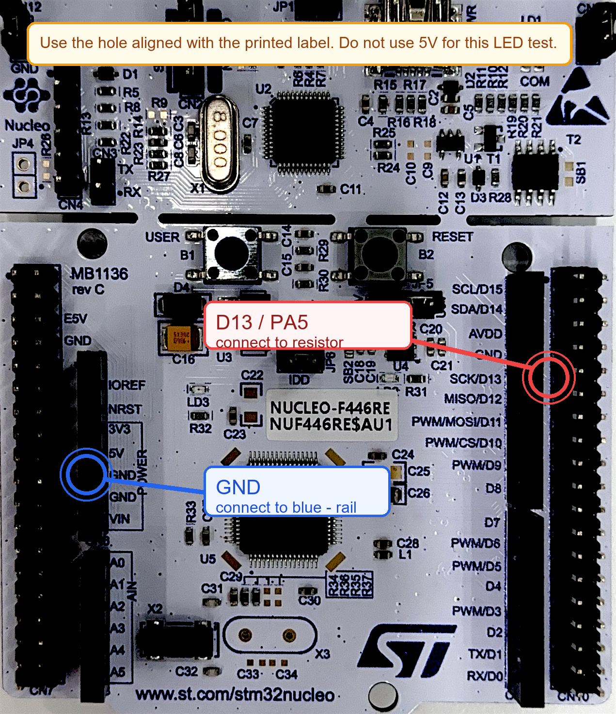
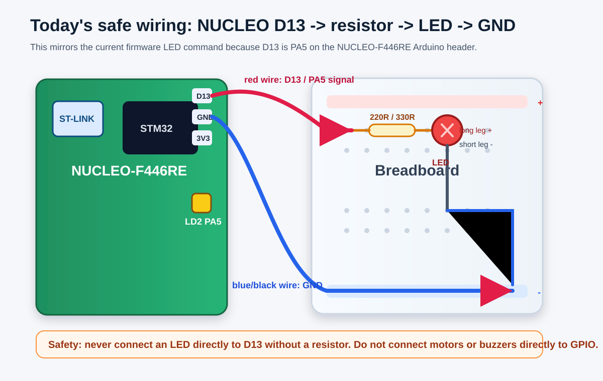

# 保姆级组装说明：按你现有套件连接 NUCLEO

这份文档假设你完全没有硬件基础。你只需要跟着做，不需要理解所有电子原理。今天我们只组装一个最安全、最简单、最有演示价值的电路：

```text
让 NUCLEO-F446RE 控制一个外接 LED 亮灭
```

当前固件已经能控制 `PA5`。在 NUCLEO-F446RE 的 Arduino 兼容排针上，`PA5` 通常也标成 `D13`。板子上自带的绿色 LED `LD2` 就是接在这个引脚上。所以我们今天把一个外接 LED 也接到 `D13`，让它跟板载 `LD2` 一起亮灭。

但是要注意：你现在发来的套件图里明确有 `LED`，但我没有在图片标注里看到单独的 `电阻`。**如果你找不到 `220Ω` 或 `330Ω` 电阻，就不要接散装 LED。** 这种情况下今天先只做 NUCLEO 板载 `LD2` 测试，等明天拓展板/更多元件到货再接外设。

下面这张是根据你发来的板子俯视图标出来的。**红圈是 `D13 / PA5`，蓝圈是建议使用的 `GND`。**





## 先记住三条安全规则

1. **接线前先拔掉 NUCLEO 的 USB。**
2. **LED 必须串联电阻，不能直接接到板子上。**
3. **不确定就停下来，不要硬插。**

如果你手里没有 `220Ω` 或 `330Ω` 电阻，今天先不要接外接 LED。没有电阻直接接 LED，有可能让电流过大，伤 LED 或伤板子。

## 你这套东西里哪些今天能用

根据你发的套件图，目前能确认有这些东西：

| 套件里的东西 | 今天能不能接 NUCLEO | 原因 |
|---|---|---|
| 杜邦线 / 面包板飞线 | 可以 | 用来连接 NUCLEO 和面包板 |
| 面包板 | 可以 | 用来插 LED、电阻和线 |
| LED | 只有找到电阻才可以 | 散 LED 不能直接接 GPIO |
| 按键 | 今天先不接 | 需要改固件读取输入，下一步可做 |
| OLED 显示屏 | 今天先不接 | 需要 I2C 接线和固件驱动 |
| 蜂鸣器 | 今天先不接 | 需要确认模块引脚和电流，最好先看实物丝印 |
| 电位器 | 今天先不接 | 需要 ADC 读取，当前固件没写 |
| 光敏/热敏/红外传感器 | 今天先不接 | 需要确认供电和信号脚 |
| MPU6050 | 今天先不接 | 需要 I2C 驱动 |
| SG90 舵机 / 直流电机 | 今天不要接 | 不能直接接 GPIO，需要供电和驱动 |
| TB6612FNG 电机驱动 | 今天先不接 | 这是电机驱动，等需要马达时再用 |
| W25Q64 Flash | 今天先不接 | SPI 存储芯片，和当前演示无关 |

所以今天分两种情况：

```text
情况 A：你能在套件里找到 220Ω 或 330Ω 电阻
=> 可以接外接 LED

情况 B：你找不到电阻
=> 不接外接 LED，只用 NUCLEO 板载 LD2 测试
```

## 如果能找到电阻，需要哪些东西

| 零件 | 数量 | 长什么样 / 怎么确认 |
|---|---:|---|
| NUCLEO-F446RE | 1 | 绿色开发板，上面有 `ST-LINK` 和 `STM32` 芯片 |
| 面包板 | 1 | 白色塑料板，上面很多小孔 |
| LED | 1 | 透明或彩色小灯，有两条腿 |
| 电阻 | 1 | 小圆柱，两端有金属腿，有色环 |
| 杜邦线 | 2-3 根 | 彩色插线 |
| USB 线 | 1 | 连接电脑和 NUCLEO |

推荐电阻：

```text
220Ω：红 红 棕 金
330Ω：橙 橙 棕 金
```

色环不认识也没关系。如果你的套件包装袋上写着 `220R`、`220Ω`、`330R`、`330Ω`，就可以用。

如果你翻遍套件都找不到这种电阻，直接跳到本文后面的“没有电阻怎么办”。

## 认识 LED：哪边是正，哪边是负

LED 有两条腿：

```text
长脚 = 正极 = 接 D13 那一边
短脚 = 负极 = 接 GND 那一边
```

还有一个辅助判断：

```text
LED 透明壳里面较大的金属片那边，通常是负极
```

但你先按“长脚正、短脚负”来判断就够了。

## 认识电阻：方向无所谓

电阻没有正负方向。你可以随便调头插。

它的作用是“限流”，可以理解成给 LED 加一个保护垫。今天的连接必须是：

```text
D13 -> 电阻 -> LED 长脚 -> LED 短脚 -> GND
```

不要接成：

```text
D13 -> LED -> GND
```

这种少了电阻，不安全。

## 认识面包板：不要被孔吓到

面包板上有很多孔，但规律很简单。

通常中间区域是这样连接的：

```text
同一横排的 5 个孔是连在一起的
中间有一条沟，沟的左右两边不连
```

侧边红色/蓝色电源轨通常是这样：

```text
红色 +：常用来接电源正极
蓝色 -：常用来接 GND
```

今天我们只用蓝色 `-` 电源轨当作 `GND`，红色 `+` 暂时不用。

## 找 NUCLEO 上的两个针脚

你需要在 NUCLEO 上找到两个位置：

```text
D13
GND
```

### D13 在哪里：看板子右侧

把板子按你发的俯视图那样摆正，也就是：

```text
USB 口在上方
ST 的大 logo 在下方
右侧有一整条黑色长排母座
```

在右侧这条黑色长排母座的左边，你能看到一列白色丝印文字：

```text
SCL/D15
SDA/D14
AVDD
GND
SCK/D13
MISO/D12
PWM/MOSI/D11
...
```

今天要接的是：

```text
SCK/D13
```

也就是说：

```text
找到右侧丝印 SCK/D13
看它正右边对应的那个黑色母座孔
这一个孔就是今天的 D13 / PA5 信号孔
```

如果你从这组文字往下看，`SCK/D13` 在 `GND` 的下面、`MISO/D12` 的上面。不要接到 `D12`，也不要接到上面那个 `GND`。

### GND 在哪里：建议用左侧 POWER 区域

板子上有很多 `GND`，理论上任意一个都可以。但为了你第一次接线更清楚，今天建议使用左侧 `POWER` 区域里的 `GND`。

把板子按俯视图摆正后，看左侧那条黑色长排母座。它右边有白色丝印：

```text
3V3
5V
GND
GND
VIN
```

今天建议接这个位置：

```text
左侧 POWER 区域里，紧挨着 5V 下方的那个 GND
```

也就是：

```text
5V 下面第一行 GND
```

注意：

```text
不要把线插到 5V
不要把线插到 3V3
要插到 GND
```

## 最终电路长什么样

你脑子里先记住这条线：

```text
NUCLEO 右侧 SCK/D13 对应孔
  -> 电阻
  -> LED 长脚
  -> LED 短脚
  -> NUCLEO 左侧 POWER 区域 GND
```

换成人话就是：

```text
信号从右侧 `SCK/D13` 出来，经过电阻保护，再经过 LED，最后回到左侧 `POWER` 区域的 `GND`。
```

## 逐步接线：一条一条做

### 第 0 步：断电

先把 NUCLEO 的 USB 从电脑上拔掉。

只要你在插线、换线，就先断电。这个习惯非常重要。

### 第 1 步：把 LED 插到面包板中间

把 LED 插到面包板中间区域，不要插到侧边红蓝电源轨。

要求：

```text
LED 长脚和短脚必须插在不同横排
```

如果两条腿插在同一横排，就等于短接在一起，电路不对。

你可以这样想：

```text
长脚插在第 20 排
短脚插在第 22 排
```

具体第几排不重要，只要不是同一排。

### 第 2 步：把电阻接到 LED 长脚那一排

把电阻的一端插到 LED 长脚所在的同一排。

例如：

```text
LED 长脚在第 20 排
电阻一端也插第 20 排
```

电阻另一端插到旁边另一排，例如第 16 排。

于是现在是：

```text
电阻另一端这一排 -> 电阻 -> LED 长脚这一排
```

### 第 3 步：右侧 SCK/D13 接到电阻另一端

拿一根杜邦线。

一端插 NUCLEO 的：

```text
右侧黑色长排母座上，和 SCK/D13 丝印对齐的那个孔
```

另一端插面包板上：

```text
电阻另一端所在的那一排
```

也就是不是 LED 长脚那边，而是电阻的另一头。

现在这半边应该是：

```text
NUCLEO SCK/D13 -> 杜邦线 -> 电阻 -> LED 长脚
```

### 第 4 步：LED 短脚接到蓝色负极轨

拿一根短杜邦线，或者直接用 LED 短脚附近的一根线。

把 LED 短脚所在的那一排接到面包板侧边的：

```text
蓝色 - 电源轨
```

这一步的意思是：LED 的负极先接到面包板的公共地轨。

### 第 5 步：NUCLEO 左侧 POWER 区域 GND 接到蓝色负极轨

再拿一根杜邦线。

一端插 NUCLEO 的：

```text
左侧 POWER 区域里，5V 下面第一行 GND
```

另一端插面包板的：

```text
蓝色 - 电源轨
```

现在完整电路就是：

```text
SCK/D13 -> 电阻 -> LED 长脚 -> LED 短脚 -> 蓝色 - 电源轨 -> POWER 区域 GND
```

## 上电前检查清单

插 USB 前，逐条检查：

- LED 长脚是不是接向电阻和 `D13`。
- LED 短脚是不是接向 `GND`。
- 电阻是不是串在右侧 `SCK/D13` 和 LED 长脚之间。
- NUCLEO 左侧 `POWER` 区域的 `GND` 是否接到了面包板蓝色 `-` 电源轨。
- 没有把右侧 `SCK/D13` 直接接到 `GND`。
- 没有把 `5V` 接进这个 LED 电路。
- 红色 `+` 电源轨今天没有用，空着没关系。

## 没有电阻怎么办

如果你没有找到电阻，今天不要把散装 LED 接到 `D13`。

你仍然可以验证 NUCLEO 在项目里的作用，因为板子上已经有一个板载绿色 LED：

```text
LD2
```

它已经接在 `PA5 / D13` 上，不需要你额外接线。你只需要运行 PC 程序，然后菜单选择：

```text
2. Turn LED on
3. Turn LED off
```

预期效果：

```text
NUCLEO 板载绿色 LD2 亮灭
```

这一步虽然没有面包板外接灯，但仍然证明了：

```text
PC C++ 程序 -> 串口 -> NUCLEO -> 硬件 LED 反馈
```

等你有电阻或拓展板后，再接外接 LED。

如果以上都确认了，再插 USB。

## 软件测试

插上 NUCLEO 的 USB 后，运行：

```powershell
& "$env:USERPROFILE\scoop\apps\msys2\current\msys2_shell.cmd" -defterm -no-start -ucrt64 -c "cd '/d/VScode Projects/Embedded_AI' && ./build-msys2-console/hardware/pi_bridge/embedded_ai_pc_bridge.exe COM11"
```

看到菜单后，输入：

```text
2
```

预期结果：

```text
板载绿色 LD2 亮
面包板上的外接 LED 亮
控制台显示 LED command OK.
```

然后输入：

```text
3
```

预期结果：

```text
板载绿色 LD2 灭
面包板上的外接 LED 灭
控制台显示 LED command OK.
```

## 如果外接 LED 不亮怎么办

先看板载 `LD2`：

### 情况 A：板载 LD2 亮，外接 LED 不亮

说明程序和 NUCLEO 没问题，问题在外接电路。

按顺序检查：

1. LED 是否插反。把 LED 两条腿对调试试。
2. 电阻是否真的串在 `D13` 和 LED 长脚之间。
3. LED 两条腿是否插在了同一排。它们必须在不同排。
4. 面包板蓝色 `-` 是否真的接到了 NUCLEO 的 `GND`。
5. 你接的是不是右侧 `SCK/D13` 对应孔，不是下面的 `MISO/D12` 或别的孔。

### 情况 B：板载 LD2 也不亮

说明程序、串口或固件那边可能有问题。

检查：

1. NUCLEO 是否插着 USB。
2. 程序里 COM 口是否还是 `COM11`。
3. 菜单选 `1. Test hardware connection` 是否显示 `Hardware connection OK.`。
4. 如果 COM 口变了，需要改命令里的 `COM11`。

### 情况 C：LED 一直亮，关不掉

可能接到了 `3V3` 或 `5V`，而不是 `D13`。

断电后检查：

```text
外接 LED 的信号线必须来自右侧 `SCK/D13`，不是 `3V3`，不是 `5V`。
```

### 情况 D：插上 USB 后电脑弹断连，或者板子异常

立刻拔掉 USB。

这可能是短路。重点检查：

```text
D13 有没有直接碰到 GND
5V 有没有接到 GND
LED 两脚有没有被插到同一排导致奇怪连接
```

## 今天不要做的事

今天不要接：

- 直流电机
- 震动马达
- 继电器
- 不确定型号的蜂鸣器
- OLED
- 任何你不知道 VCC/GND/SIG 是什么的模块

原因不是它们不能用，而是它们需要额外确认供电、电流、驱动方式。特别是马达类东西不能直接接 NUCLEO GPIO。

你套件里的 `130 直流电机`、`SG90 舵机`、`TB6612FNG 电机驱动` 都先不要碰。它们是后续机械动作演示用的，不适合第一步直接接。

## 明天/下一阶段优先接哪个模块

等拓展板到货后，优先级建议是：

1. `按键`：让用户按一下触发拍照识别。
2. `OLED 显示屏`：显示 Qwen 返回的短句，比如 `SCENE OK`。
3. `蜂鸣器`：高风险时响一下。
4. `震动马达`：模拟智能眼镜/可穿戴提醒。

不建议一上来接电机或舵机。它们演示效果好，但接线和供电更容易出问题。

## 你接好后应该看到什么意义

这一步完成后，NUCLEO 就不再只是“插在电脑上的板子”。它会变成：

```text
AI 结果的物理反馈端
```

现在是 LED 亮灭。明天拓展板和更多模块到货后，我们再升级成：

```text
OLED 显示短句
蜂鸣器报警
震动提醒
按键触发
```

今天先把第一盏外接灯点亮。这个动作很小，但它是整个 AI 智能眼镜原型从“软件”走向“硬件”的第一步。
