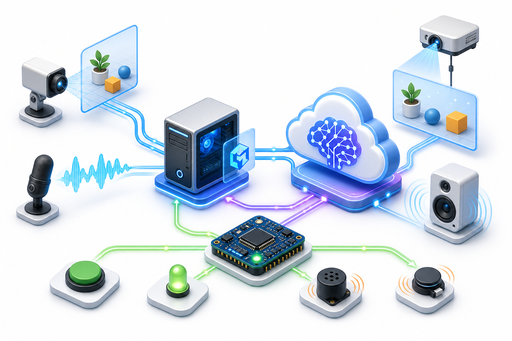
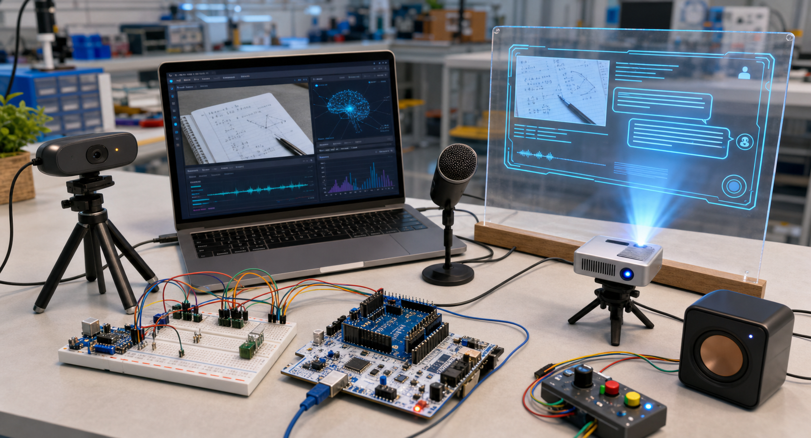
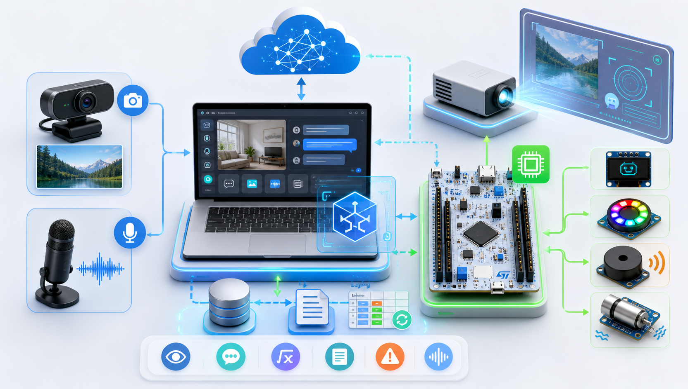
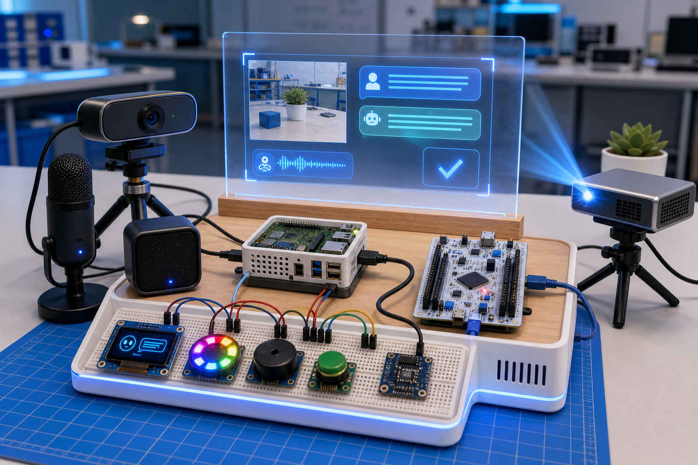

# Embedded AI Reality Bridge 演示文档

本文档用于课堂展示、答辩演示和现场排障。当前演示版本已经在树莓派 5 上跑通：摄像头采集画面，C++ 程序调用 Qwen 视觉模型分析画面，并通过串口与 NUCLEO-F446RE 通信。

## 1. 演示目标

本项目演示一个“AI 智能眼镜/视觉助手”的桌面原型。它暂时不做成眼镜外形，而是先验证核心能力：

- 摄像头实时获取当前画面。
- 树莓派运行 C++ 主程序，负责摄像头、API 调用和演示交互。
- Qwen 视觉模型理解画面，并返回场景描述、解题辅助或安全风险分析。
- NUCLEO-F446RE 作为嵌入式执行端，通过串口接收命令，控制板载 LED 等硬件反馈。
- 程序保存审计日志，展示 C++ 文件读写、随机访问更新和面向对象设计。



## 2. 当前硬件状态

当前已验证的硬件连接如下：

```text
Logitech C270 摄像头
    -> USB
Raspberry Pi 5 8GB
    -> 运行 Linux / C++ 主程序 / OpenCV / libcurl
    -> 调用 Qwen 视觉 API
    -> USB 串口
NUCLEO-F446RE
    -> 接收 PING、LED、STATUS 等命令
    -> 板载 LED 反馈
```

当前不要把 Gravity IO 扩展板插到树莓派 40-pin 上。Gravity IO 是 Arduino/NUCLEO 兼容扩展板，不是树莓派 HAT。后续如果接 OLED、按键、蜂鸣器、震动模块，应先接到 NUCLEO 的 Arduino 排针侧，再由 NUCLEO 负责硬件控制。



## 3. 上台前检查清单

上台前至少检查一次：

- 树莓派已接电，系统正常进入 Linux。
- Logitech C270 摄像头已插入树莓派 USB 口。
- NUCLEO-F446RE 已通过 USB 插入树莓派。
- 树莓派可以联网，校园网没有掉认证。
- `config/qwen-vision.ini` 存在。
- `config/qwen-vision.key` 存在，并且只在本地保存，不提交 Git。
- 项目已经完成编译，存在 `build-pi/src/pc/embedded_ai_pc_bridge`。

在树莓派终端中执行：

```bash
cd ~/Desktop/Embedded_AI
lsusb
ls /dev/video*
ls /dev/ttyACM*
```

期望看到：

```text
Logitech 摄像头出现在 lsusb 中
/dev/video0 或类似 video 设备
/dev/ttyACM0
```

## 4. 启动命令

进入项目目录：

```bash
cd ~/Desktop/Embedded_AI
```

运行真实 Qwen 视觉模式：

```bash
./build-pi/src/pc/embedded_ai_pc_bridge /dev/ttyACM0 --qwen
```

如果只是排练，不想调用 API，可以运行 Mock 模式：

```bash
./build-pi/src/pc/embedded_ai_pc_bridge /dev/ttyACM0
```

程序启动后会显示菜单：

```text
1. Test hardware connection
2. Turn LED on
3. Turn LED off
4. Simulate AI task
5. View audit log
6. Update audit log status
7. Capture camera frame
8. Capture and analyze current frame
0. Exit
```

## 5. 推荐演示流程

### 5.1 硬件连接测试

选择：

```text
1
```

预期现象：

- 程序显示 `Hardware connection OK.`
- 能读取设备状态，例如 LED、蜂鸣器、震动、OLED 状态。
- 说明树莓派与 NUCLEO 的 USB 串口通信正常。

### 5.2 LED 反馈测试

选择：

```text
2
```

预期现象：

- NUCLEO 板载绿色 LED 亮起。
- 程序显示 `LED command OK.`

然后选择：

```text
3
```

预期现象：

- NUCLEO 板载绿色 LED 熄灭。

### 5.3 摄像头抓拍测试

选择：

```text
7
```

预期现象：

- 程序显示摄像头抓拍成功。
- 图片保存到：

```text
captures/latest-frame.jpg
```

如果现场需要确认画面，可以在树莓派桌面文件管理器里打开该图片。

### 5.4 Qwen 视觉描述演示

选择：

```text
8
1
```

含义：

- `8`：抓取当前画面并分析。
- `1`：让模型描述当前场景。

预期现象：

- 程序先保存一张摄像头图片。
- 程序调用 `qwen3-vl-8b-instruct`。
- 终端输出模型对当前画面的描述。
- 审计日志写入一条视觉分析记录。

### 5.5 解题辅助演示

把一道题目、纸张或屏幕内容放到摄像头前，选择：

```text
8
2
```

预期现象：

- 模型尝试读取画面中的题目。
- 输出解题思路或辅助说明。

课堂展示时建议把题目写得大一些，避免摄像头自动对焦、光照或分辨率影响识别。

### 5.6 安全风险分析演示

把面包板、线材或硬件模块放到摄像头前，选择：

```text
8
3
```

预期现象：

- 模型从画面中识别硬件场景。
- 输出是否存在潜在风险，例如线材杂乱、电源连接不明、模块靠得太近等。

## 6. 可以怎么讲项目架构

答辩时可以这样解释：

```text
树莓派是主控小电脑：
  负责运行 Linux、C++ 程序、OpenCV 摄像头采集、HTTPS API 调用。

NUCLEO 是嵌入式硬件执行端：
  负责接收串口命令，控制 LED、蜂鸣器、震动、OLED 等低层硬件。

Qwen 视觉模型是 AI 认知层：
  负责理解摄像头画面，输出描述、解题辅助、安全分析。

C++ 程序是中间调度层：
  把摄像头、AI 模型、串口硬件、审计日志统一组织起来。
```



## 7. C++ 作业要求对应关系

当前项目可以对应以下 C++ 大作业要求：

- 面向对象设计：`CameraService`、`AiVisionService`、`HardwareBridge`、`PrototypeDeviceSet`、`AuditLogStore` 等类。
- 继承和多态：Mock 视觉服务与 Qwen 视觉服务实现同一接口，摄像头服务也通过接口抽象。
- 文件读写：`audit-log.dat` 保存演示记录。
- 随机访问文件：审计日志支持按记录 ID 更新状态。
- UI：终端菜单作为当前原型 UI；后续可以扩展为 GUI 或网页控制台。
- C++ 代码规模：PC 端和固件端均使用 C++ 编写，代码量已经满足大作业规模要求。
- 嵌入式结合：树莓派负责高层计算，NUCLEO 负责底层硬件反馈。

## 8. 常见问题和快速处理

### 8.1 找不到 NUCLEO 串口

现象：

```text
ERROR: Cannot open serial port /dev/ttyACM0
```

检查：

```bash
ls /dev/ttyACM*
```

如果没有输出：

- 重新插拔 NUCLEO USB 线。
- 换树莓派另一个 USB 口。
- 确认 NUCLEO 已供电。

如果出现 `/dev/ttyACM1`，运行时改用：

```bash
./build-pi/src/pc/embedded_ai_pc_bridge /dev/ttyACM1 --qwen
```

### 8.2 找不到摄像头

现象：

```text
camera capture failed: no readable camera found
```

检查：

```bash
lsusb
ls /dev/video*
```

如果 `ffmpeg` 可用，可以单独抓一张测试图：

```bash
mkdir -p ~/camera-test
ffmpeg -y -f v4l2 -video_size 1280x720 -i /dev/video0 -frames:v 1 -update 1 ~/camera-test/test.jpg
```

### 8.3 Qwen API 调用失败

先确认本地配置文件存在：

```bash
ls config/qwen-vision.ini config/qwen-vision.key
```

不要把 `qwen-vision.key` 内容发到聊天、截图或 GitHub。

如果校园网掉认证，树莓派可能无法访问 API。可以先测试网络：

```bash
ping -c 4 223.5.5.5
ping -c 4 dashscope.aliyuncs.com
```

### 8.4 上台时不想使用真实 API

可以运行 Mock 模式：

```bash
./build-pi/src/pc/embedded_ai_pc_bridge /dev/ttyACM0
```

Mock 模式不会产生 API 费用，适合演示硬件链路、菜单 UI、日志功能。

## 9. 后续扩展路线

当前主链路已经跑通，后续可以按这个顺序扩展：

1. 接 Gravity IO 到 NUCLEO，简化传感器和 OLED 接线。
2. 接 OLED，让分析结果摘要显示在小屏幕上。
3. 接按键，让用户不用键盘也能触发拍照分析。
4. 接蜂鸣器或震动模块，风险分析为高风险时给出物理提醒。
5. 做开机自启动脚本，让树莓派通电后自动进入演示程序。
6. 做网页/GUI 控制台，让展示效果更接近产品原型。



## 10. 最小成功演示标准

如果时间紧，最小演示只需要完成这四步：

```text
1 -> 确认 NUCLEO 通信正常
2 -> 点亮 NUCLEO 板载 LED
7 -> 摄像头抓拍成功
8 -> 1 -> Qwen 描述当前画面
```

只要这四步成功，就能证明本项目完成了从画面采集、AI 理解、C++ 调度到嵌入式硬件反馈的完整闭环。
