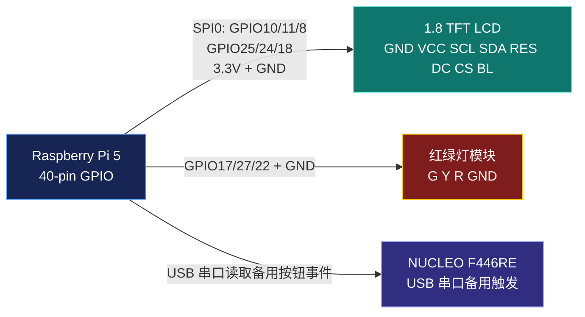

# 树莓派 LCD 与红绿灯接线指南

> 2026-06-15 更新：旧旋钮功能已经从程序中完全取消。请断开旋钮的 `GND/UCC/A/C/B` 五根线；原来占用的 `GPIO5 / Pin 29` 和 `GPIO6 / Pin 31` 已释放，后续不再使用该模块。

本文档用于把 1.8 寸 `128x160 RGB TFT LCD` 和红绿灯 LED 模块接到 Raspberry Pi 5。

目标效果：

- LCD 显示最新 AI 回复，标题为 `AI REPLY 0`。
- NUCLEO 蓝色按钮目前仍可开始 5 秒语音输入，后续将由三键键盘的 `K-B` 接管。
- 红绿灯状态：
  - 绿灯：系统就绪，可以按对话触发键。
  - 黄灯：录音、语音识别、拍照或 AI 响应中。
  - 红灯：故障，例如摄像头失败、AI 响应失败、录音失败等。

## 0. 安全规则

1. 接线前先关闭树莓派电源，拔掉 USB-C 供电线。
2. 本方案的 LCD 使用树莓派 `3.3V` 供电，不要接 `5V`。
3. 所有模块的 `GND` 必须接到树莓派 `GND`。
4. LCD 顶部 8 个孔如果没有焊排针，需要先焊好排针，否则杜邦线接触会非常不稳定。
5. 红绿灯模块通常已经自带限流电阻，不需要再额外串电阻。如果灯明显发热，立刻断电检查。

## 1. 树莓派 40-pin 方向

让树莓派 USB 口和网口朝外侧，40-pin 排针在你面前时，常用物理针脚如下：

```text
左列奇数                         右列偶数
Pin 1  3.3V                       Pin 2  5V
Pin 3  GPIO2                      Pin 4  5V
Pin 5  GPIO3                      Pin 6  GND
Pin 7  GPIO4                      Pin 8  GPIO14
Pin 9  GND                        Pin10  GPIO15
Pin11  GPIO17                     Pin12  GPIO18
Pin13  GPIO27                     Pin14  GND
Pin15  GPIO22                     Pin16  GPIO23
Pin17  3.3V                       Pin18  GPIO24
Pin19  GPIO10 MOSI                Pin20  GND
Pin21  GPIO9 MISO                 Pin22  GPIO25
Pin23  GPIO11 SCLK                Pin24  GPIO8 CE0
Pin25  GND                        Pin26  GPIO7 CE1
Pin29  GPIO5                      Pin31  GPIO6
Pin36  GPIO16
```

## 2. LCD 接线表

你的 LCD 顶部丝印是：

```text
GND VCC SCL SDA RES DC CS BL
```

按下面接到树莓派：

| LCD 引脚 | 接到树莓派物理针脚 | 树莓派 BCM | 作用 |
|---|---:|---:|---|
| `GND` | Pin 6 | GND | 地线 |
| `VCC` | Pin 1 | 3.3V | 屏幕供电 |
| `SCL` | Pin 23 | GPIO11 | SPI 时钟 SCLK |
| `SDA` | Pin 19 | GPIO10 | SPI 数据 MOSI |
| `RES` | Pin 22 | GPIO25 | LCD 复位 |
| `DC` | Pin 18 | GPIO24 | 命令/数据选择 |
| `CS` | Pin 24 | GPIO8 | SPI 片选 CE0 |
| `BL` | Pin 12 | GPIO18 | 背光控制 |

注意：这个屏幕虽然写着 `SCL/SDA`，但这里按 SPI 接，不是 I2C。`SDA` 接 MOSI，`SCL` 接 SCLK。

## 3. 红绿灯模块接线表

你的红绿灯模块底部丝印是：

```text
G Y R GND
```

| 红绿灯引脚 | 接到树莓派物理针脚 | 树莓派 BCM | 状态 |
|---|---:|---:|---|
| `G` | Pin 11 | GPIO17 | 绿灯，系统就绪 |
| `Y` | Pin 13 | GPIO27 | 黄灯，AI 处理中 |
| `R` | Pin 15 | GPIO22 | 红灯，故障 |
| `GND` | Pin 9 | GND | 地线 |

如果测试时颜色不对应，只交换 `G/Y/R` 三根信号线，不要动 `GND`。

## 4. 已停用的旋钮模块

旧旋钮模块 5 个针脚是：

```text
GND UCC A C B
```

该模块已经退出当前方案。关机断电后，把它的五根杜邦线全部拔下并单独收好，不要继续占用树莓派 GPIO。

## 5. 接线示意图



## 6. 上电测试

接好线后，在树莓派终端执行：

```bash
cd ~/Embedded_AI
bash scripts/setup-pi-hud.sh
```

这个脚本会安装依赖、开启 SPI，并测试 LCD 与红绿灯。更新代码后执行：

```bash
cd ~/Embedded_AI
git pull
cmake --build build-pi
systemctl --user restart embedded-ai.service
tail -f logs/embedded-ai.log
```

预期现象：

1. 服务启动后绿灯亮，LCD 显示系统就绪。
2. 按下 NUCLEO 蓝色按钮后黄灯亮，LCD 显示录音 5 秒倒计时。
3. 录音结束后 LCD 显示 `AI 响应中`。
4. AI 完成后绿灯亮，LCD 显示 `AI REPLY 0` 和最新回复摘要。
5. 如果摄像头、录音或 AI 请求失败，红灯亮，LCD 显示具体错误。
