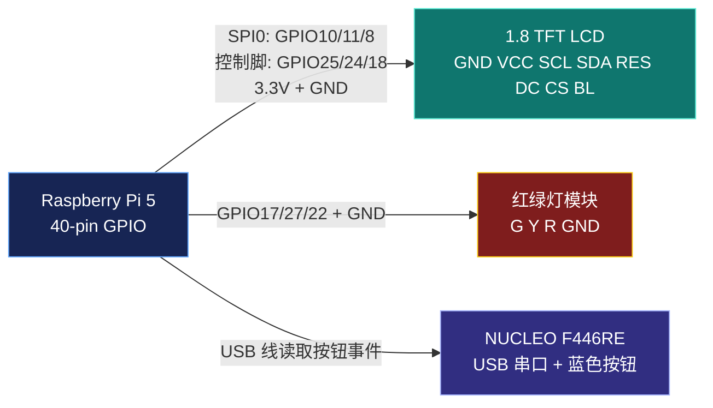

# 树莓派 LCD + 红绿灯模块组装指南

本文档用于把 1.8 寸 `128x160 RGB TFT LCD` 和红绿灯 LED 模块接到 Raspberry Pi 5 上。

目标：

- LCD 只显示 AI 回复文本。
- 红绿灯模块显示系统状态：
  - 绿灯：系统正常，可以按 NUCLEO 蓝色按钮。
  - 黄灯：AI 正在处理中。
  - 红灯：故障，例如 SSH 连接失败、中断、摄像头失败、AI 响应失败或超时。

## 0. 先看安全规则

1. 接线前必须关闭树莓派电源，并拔掉 USB-C 供电线。
2. 本方案全部使用树莓派 `3.3V` 逻辑，不要把 LCD 的 `VCC` 接到 `5V`。
3. 所有模块的 `GND` 必须接到树莓派 `GND`。
4. LCD 图片里那排孔如果没有焊排针，必须先焊上 8Pin 排针，否则杜邦线接不稳。
5. 红绿灯模块大概率已经带限流电阻，所以不用再额外串电阻。如果灯特别亮或发烫，立刻断电。

## 1. 树莓派 40-pin 方向

让树莓派的 USB 口和网口朝外侧，40-pin 排针在你面前时，常用物理针脚如下：

```text
左列奇数                         右列偶数
Pin 1  3.3V                       Pin 2  5V
Pin 3  GPIO2                      Pin 4  5V
Pin 5  GPIO3                      Pin 6  GND
Pin 7  GPIO4                      Pin 8  GPIO14
Pin 9  GND                        Pin10  GPIO15
Pin11  GPIO17                     Pin12  GPIO18
Pin13  GPIO27                     Pin14  GND
Pin15  GPIO22                     Pin16  GPIO23
Pin17  3.3V                       Pin18  GPIO24
Pin19  GPIO10 MOSI                Pin20  GND
Pin21  GPIO9 MISO                 Pin22  GPIO25
Pin23  GPIO11 SCLK                Pin24  GPIO8 CE0
Pin25  GND                        Pin26  GPIO7 CE1
```

## 2. LCD 接线表

你的 LCD 顶部丝印是：

```text
GND VCC SCL SDA RES DC CS BL
```

按下面接到树莓派：

| LCD 引脚 | 接到树莓派物理针脚 | 树莓派 BCM | 作用 |
|---|---:|---:|---|
| `GND` | Pin 6 | GND | 地线 |
| `VCC` | Pin 1 | 3.3V | 屏幕供电 |
| `SCL` | Pin 23 | GPIO11 | SPI 时钟 SCLK |
| `SDA` | Pin 19 | GPIO10 | SPI 数据 MOSI |
| `RES` | Pin 22 | GPIO25 | LCD 复位 |
| `DC` | Pin 18 | GPIO24 | 命令/数据选择 |
| `CS` | Pin 24 | GPIO8 | SPI 片选 CE0 |
| `BL` | Pin 12 | GPIO18 | 背光控制 |

注意：

- 这个屏幕虽然写 `SCL/SDA`，但它不是 I2C，这里按 SPI 接。
- `SDA` 接树莓派 `MOSI`，不要接到 I2C 的 GPIO2。
- `SCL` 接树莓派 `SCLK`，不要接到 I2C 的 GPIO3。

## 3. 红绿灯模块接线表

你的红绿灯模块底部丝印是：

```text
G Y R GND
```

按下面接到树莓派：

| 红绿灯引脚 | 接到树莓派物理针脚 | 树莓派 BCM | 状态 |
|---|---:|---:|---|
| `G` | Pin 11 | GPIO17 | 绿灯，系统就绪 |
| `Y` | Pin 13 | GPIO27 | 黄灯，AI 处理中 |
| `R` | Pin 15 | GPIO22 | 红灯，故障 |
| `GND` | Pin 9 | GND | 地线 |

如果测试时颜色和状态不匹配，只需要改线：`G/Y/R` 三根信号线互换即可。

## 4. 接线示意图



## 5. 第一次上电测试

接好线后，先不要急着跑 AI，先在树莓派终端执行：

```bash
cd ~/Embedded_AI
bash scripts/setup-pi-hud.sh
```

这个脚本会做四件事：

1. 安装 LCD 需要的 Python 库。
2. 开启树莓派 SPI。
3. 测试绿灯、黄灯、红灯。
4. 在 LCD 上显示一条测试回复。

如果 LCD 不亮，先重启一次：

```bash
sudo reboot
```

如果仍然不亮，看错误日志：

```bash
cat /tmp/embedded-ai-hud.log
```

## 5.1 红绿灯一直绿色怎么办

先确认软件有没有真的切换 GPIO：

```bash
cd ~/Embedded_AI
python3 hardware/pi_bridge/scripts/pi_hud.py ready "ready"
pinctrl get 17
pinctrl get 27
pinctrl get 22

python3 hardware/pi_bridge/scripts/pi_hud.py busy "busy"
pinctrl get 17
pinctrl get 27
pinctrl get 22

python3 hardware/pi_bridge/scripts/pi_hud.py error "error"
pinctrl get 17
pinctrl get 27
pinctrl get 22
```

正确结果应该是：

```text
ready: GPIO17=hi, GPIO27=lo, GPIO22=lo
busy:  GPIO17=lo, GPIO27=hi, GPIO22=lo
error: GPIO17=lo, GPIO27=lo, GPIO22=hi
```

如果命令结果正确，但肉眼仍然一直绿，说明软件没问题，通常是接线问题：

1. 检查红绿灯模块 `G/Y/R/GND` 四根线有没有接反。
2. 确认 `GND` 接树莓派 `Pin 9`，不要接到 `3.3V` 或 `5V`。
3. 确认 `G` 接 `Pin 11`，`Y` 接 `Pin 13`，`R` 接 `Pin 15`。
4. 如果颜色不对应，只交换 `G/Y/R` 三根信号线，不要动 `GND`。

## 6. 运行 AI 演示

更新代码、重新构建后，启动原来的服务：

```bash
cd ~/Embedded_AI
cmake --build build-pi
systemctl --user restart embedded-ai.service
```

预期现象：

1. 服务启动后，红绿灯亮绿灯，LCD 显示就绪。
2. 按下 NUCLEO 蓝色按钮，红绿灯切到黄灯。
3. AI 完成分析后，LCD 显示 AI 回复，红绿灯回到绿灯。
4. 如果摄像头、API 或 AI 分析失败，红绿灯亮红灯，LCD 显示错误信息。

## 7. LCD 为什么只显示摘要

这块屏幕只有 `128x160` 像素，不是触摸屏，也没有翻页按钮。中文字体每个字占用的像素比较多，完整 AI 回复很容易超出屏幕。

因此当前策略是：

- LCD 只显示适合硬件演示的精简摘要。
- Windows 客户端和 `logs/embedded-ai.log` 保留完整 AI 回复。
- LCD 文本会按实际像素宽度换行，超出部分用省略号 `…` 收尾，避免文字被截断到屏幕外。

如果后续要显示更多内容，有三个升级方向：

1. 增加一个外置翻页按钮。
2. 改成自动滚动字幕。
3. 换更大屏幕，例如 2.8 寸或 3.5 寸 SPI/HDMI 屏。
