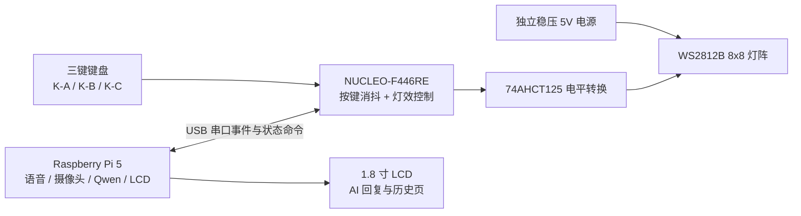

# 三键键盘与 WS2812B 8x8 灯阵设计草案

## 1. 推荐架构

推荐把三键键盘和 WS2812B 灯阵都接到 `NUCLEO-F446RE`，而不是直接接 Raspberry Pi 5。



这样分工后：

- Raspberry Pi 负责 Linux、网络、语音、摄像头、Qwen API、LCD 和历史记录。
- NUCLEO 负责三键读取、硬件消抖、灯阵实时动画和板载蓝色按钮备用输入。
- USB 串口继续作为两块板之间的通信通道。
- 旧旋钮完全退出，不再读取 GPIO5/GPIO6。

## 2. 三键功能

| 按键 | 计划功能 | NUCLEO 发给树莓派的事件 |
|---|---|---|
| `K-A` 蓝色 | 查看更旧一条回复 | `EVENT KEY A` |
| `K-B` 粉色 | 触发 5 秒语音对话 | `EVENT KEY B` |
| `K-C` 绿色 | 查看更新一条回复 | `EVENT KEY C` |

拟使用 NUCLEO Arduino 接口上的 `A0 / A1 / A2` 作为三个数字输入。照片中每路附近有 `103` 电阻，推测模块带有约 10k 下拉，但正式接线后仍要先做输入电平测试，不能只凭照片下结论。

### 三键键盘接线

接线前先关闭树莓派和 NUCLEO 电源。这个模块和 NUCLEO 两边都是突出的公针，因此需要使用 `母对母杜邦线`。

| 三键模块针脚 | 接到 NUCLEO-F446RE | 线的作用 |
|---|---|---|
| `K-A` | Arduino 模拟排针的 `A0` | 蓝色键，左翻页 |
| `K-B` | Arduino 模拟排针的 `A1` | 粉色键，触发对话 |
| `K-C` | Arduino 模拟排针的 `A2` | 绿色键，右翻页 |
| `VCC` | 电源排针的 `3V3` | 3.3V 供电，不接 5V |
| `GND` | 任意标有 `GND` 的电源针脚 | 公共地 |

操作顺序：

1. 树莓派关机，拔掉 NUCLEO USB 线。
2. 把旧旋钮的五根线全部拔掉。
3. 在 NUCLEO 板上找到一排明确印有 `A0 A1 A2 A3 A4 A5` 的 Arduino 模拟针脚。
4. 按表格连接 `K-A/K-B/K-C`，不要按颜色猜信号。
5. 在 NUCLEO 电源排针找到明确印有 `3V3` 和 `GND` 的针脚，再连接 `VCC/GND`。
6. 逐根复查，确保 `VCC` 没有接到 `5V`、`VIN` 或其他 GPIO。
7. 最后把 NUCLEO USB 重新接回树莓派，再进行事件测试。

固件将 `A0/A1/A2` 配置为带内部下拉的输入。正常预期是松开时为低电平，按下时变为 3.3V 高电平。

## 3. 灯阵状态动画

| 系统状态 | 灯阵效果 | 建议颜色 |
|---|---|---|
| 就绪 | 一颗彗星沿外框循环，中心轻微呼吸 | 青绿、深蓝 |
| 录音 | 5 秒倒计时，每秒减少一列，同时有声波跳动 | 蓝色、冰青 |
| AI 思考 | 旋转雷达或螺旋追逐 | 金黄、紫色 |
| 回复完成 | 从中心向外扩散两次波纹，随后回到就绪 | 绿色、青色 |
| 左翻页 | 蓝色箭头向左扫过 | 蓝色 |
| 右翻页 | 绿色箭头向右扫过 | 绿色 |
| 故障 | 红色 `X` 缓慢脉冲，避免高频闪烁 | 红色 |

全局亮度建议限制在 `20%~30%`，既省电，也避免 64 颗灯近距离刺眼。

## 4. 串口协议草案

NUCLEO 向 Raspberry Pi 上报：

```text
EVENT KEY A
EVENT KEY B
EVENT KEY C
```

Raspberry Pi 向 NUCLEO 下发：

```text
MATRIX:READY
MATRIX:LISTENING=5
MATRIX:THINKING
MATRIX:SUCCESS
MATRIX:ERROR
MATRIX:PAGE_LEFT
MATRIX:PAGE_RIGHT
```

灯效必须使用非阻塞状态机或定时器更新，不能在播放动画时停止接收串口命令。

## 5. 供电与保护

WS2812B 灯阵不是普通的小指示灯模块。按保守设计，64 颗灯在高亮白色时可能需要接近 `4A`，因此：

1. 不从 NUCLEO 的 `3.3V/5V` 针脚给灯阵供电。
2. 不从 Raspberry Pi 的 GPIO 针脚给灯阵供电。
3. 使用独立稳压 `5V 4A~5A` 电源给灯阵供电。
4. 灯阵电源地、NUCLEO 地必须共地。
5. 数据输入前串联 `330~470Ω` 电阻。
6. 灯阵 `5V/GND` 入口并联一个约 `1000µF`、耐压至少 `6.3V` 的电解电容。
7. NUCLEO 是 3.3V 逻辑，建议通过 `74AHCT125` 把数据升到接近 5V，再进入灯阵 `DIN`。

## 6. 暂定 NUCLEO 引脚

为了避开当前固件使用的 `PA2/PA3` 串口、`PA5` 板载 LED 和 `PC13` 板载按钮，暂定：

| 功能 | NUCLEO 接口标识 | MCU 引脚 |
|---|---|---|
| `K-A` | `A0` | `PA0` |
| `K-B` | `A1` | `PA1` |
| `K-C` | `A2` | `PA4` |
| 灯阵数据 | `D6` | `PB10` |

正式接线前还需要确认灯阵三针输入端的实际顺序，以及是否已经具备独立 5V 电源、电平转换芯片和大电容。
